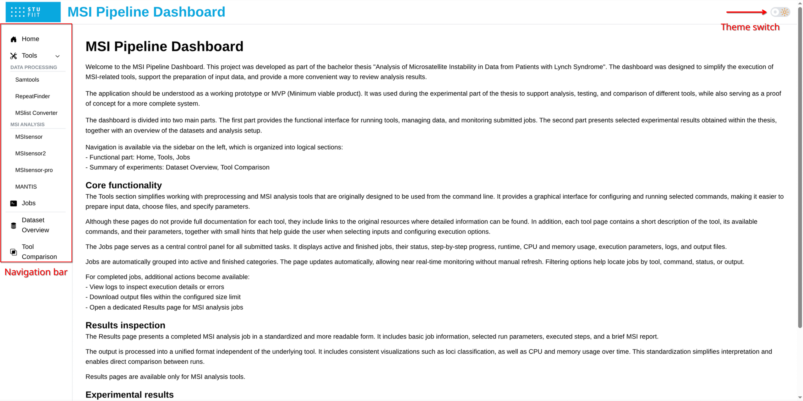
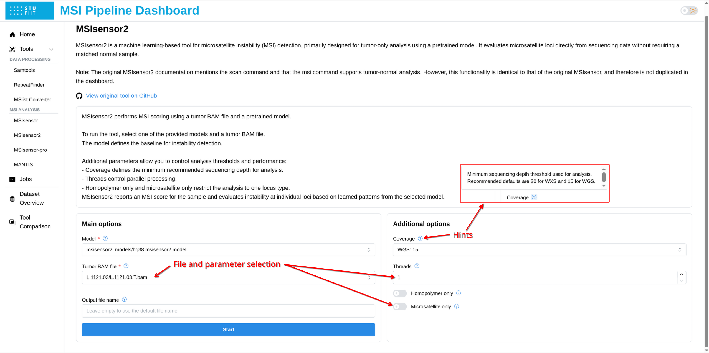
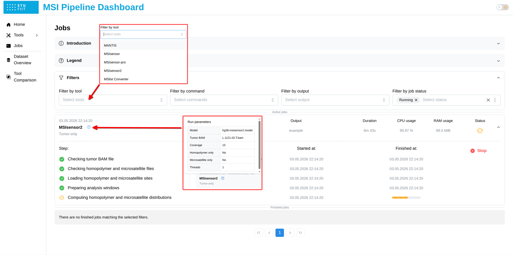
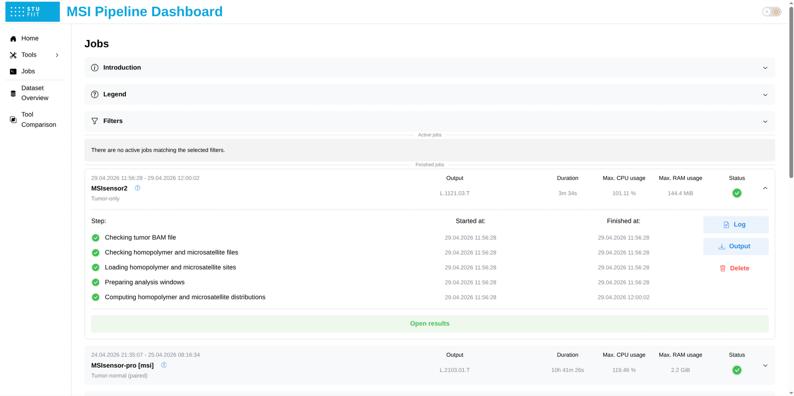
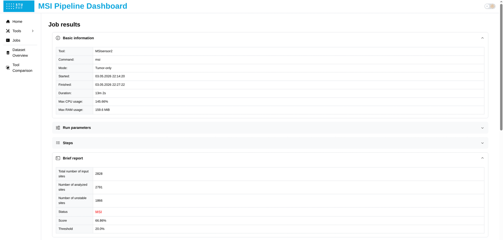
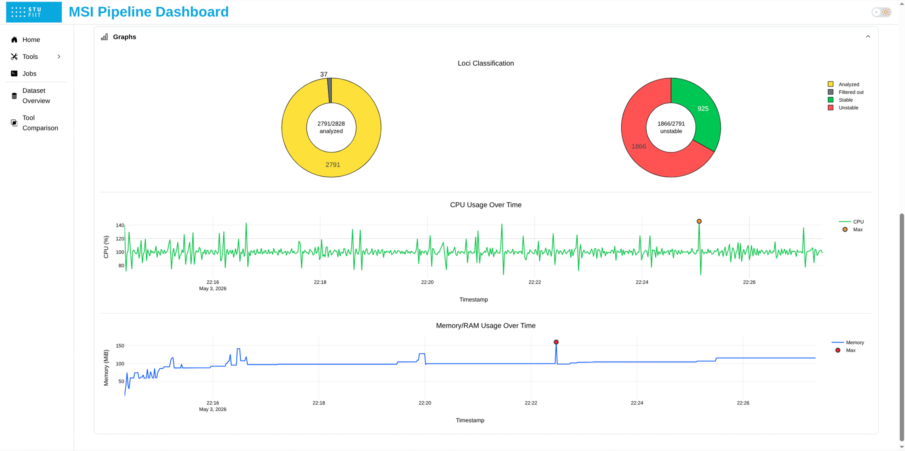

# MSI Pipeline Dashboard

A Dash-based web dashboard for running preprocessing utilities and MSI analysis tools without writing command-line commands manually. The application provides pages for tool execution, job monitoring and result inspection.

## Main features

- Web interface for selected MSI and preprocessing tools
- Job execution and monitoring
- Runtime, CPU, and memory tracking
- Downloading outputs and logs
- Result pages for completed MSI analysis jobs
- Light and dark UI themes

## Project structure

```text
msi-dashboard
├── components/        # Reusable UI components
├── configs/           # Paths, limits, tools, and command configuration
├── models/            # Job, Step, Status, and related data classes
├── pages/             # Dash pages and callbacks
├── services/          # Management of jobs, files, signals, and resource monitoring
├── assets/            # Static frontend assets
├── app.py             # Main application entry point
├── env-base.yaml      # Main Mamba environment
├── env-mantis.yaml    # Separate MANTIS environment
└── Dockerfile
```

## Software environment

The project uses Mamba (Conda) environments.

| Environment | Python | Purpose |
|---|---:|---|
| `base` | 3.14.3 | Main dashboard environment and most CLI tools |
| `mantis` | 3.8 | Separate environment for MANTIS compatibility |

Main Python packages:

| Package | Version | Purpose |
|---|---:|---|
| `dash` | 4.0.0 | Web dashboard framework |
| `dash-mantine-components` | 2.6.0 | UI components |
| `dash-iconify` | 0.1.2 | Icons |
| `plotly` | 6.6.0 | Graphs and visualizations |
| `pandas` | 3.0.2 | Data loading and processing |
| `psutil` | 7.2.2 | Process and resource monitoring |

Full environment definitions are stored in:

```text
env-base.yaml
env-mantis.yaml
```

## Integrated tools

| Tool | Version | Purpose |
|---|---:|---|
| [SAMtools](https://github.com/samtools/samtools) | 1.23.1 | BAM preprocessing |
| [MSIsensor](https://github.com/ding-lab/msisensor) | 0.6 | Tumor-normal MSI analysis |
| [MSIsensor2](https://github.com/niu-lab/msisensor2) | 0.1 | Tumor-only MSI analysis with pretrained models |
| [MSIsensor-pro](https://github.com/xjtu-omics/msisensor-pro) | 1.3.0 | Tumor-normal and tumor-only MSI analysis |
| [MANTIS](https://github.com/OSU-SRLab/MANTIS) | 1.0.5 | Tumor-normal MSI analysis |
| [RepeatFinder](https://github.com/OSU-SRLab/MANTIS/tree/master/tools) | 1.0 | Microsatellite loci generation for MANTIS |
| MSlist Converter | custom | Conversion between microsatellite loci formats |

Some tools are added manually during the Docker image build. This mainly applies to MSIsensor 0.6 and the bug-fixed RepeatFinder binary.

## Required host directories

Before running the application, create three host folders: one for input data, one for job files and generated outputs, and one for application logs.

Example structure:

```text
msi-dashboard
├── data
├── jobs
└── logs
```

The application does not require a fixed structure inside the data folder. However, it is convenient to separate models, patient files, and reference files, for example:

```text
data
├── msisensor2.models
│   ├── b37.msisensor2.model
│   ├── hg19.msisensor2.model
│   └── hg38.msisensor2.model
├── patient1
│   ├── normal.bam
│   ├── normal.bam.bai
│   ├── tumor.bam
│   └── tumor.bam.bai
├── patient2
│   ├── normal.bam
│   ├── normal.bam.bai
│   ├── tumor.bam
│   └── tumor.bam.bai
└── refgenome
    ├── hg19.fa
    ├── hg19.fa.fai
    ├── hg38.bed
    ├── hg38.fa
    ├── hg38.fa.fai
    ├── hg38.ms.list
    └── hg38.ms.list.pro
```

## Supported file types

| File type | Supported extensions |
|---|---|
| FASTA files | `.fasta`, `.fas`, `.fa`, `.fna`, `.ffn`, `.faa`, `.mpfa`, `.frn` |
| FASTA index files | `.fai` |
| BAM files | `.bam` |
| BAM index files | `.bai` |
| MSIsensor microsatellite lists | `.ms.list` |
| MSIsensor-pro microsatellite lists | `.ms.list.pro` |
| MANTIS-compatible BED files | `.bed` |
| MSIsensor2 model directories | `.msisensor2.model` |

MSIsensor2 models are not generated by the dashboard. They must be downloaded separately from the official [MSIsensor2](https://github.com/niu-lab/msisensor2) repository and placed into the `data` directory as folders with the `.msisensor2.model` suffix.

## Running with Docker

The Docker image is published through GitHub Container Registry: [msi-pipeline-dashboard-public](https://github.com/dencoderexe/FIIT-16768-127130-PUBLIC/pkgs/container/msi-pipeline-dashboard-public)

### Pull the image

Download the latest image:

```bash
docker pull ghcr.io/dencoderexe/fiit-16768-127130-public:latest
```

### Start the dashboard

Example command:

```bash
docker run -d \
  -p 8051:8050 \
  -v ~/msi-dashboard/data:/data \
  -v ~/msi-dashboard/jobs:/jobs \
  -v ~/msi-dashboard/logs:/logs \
  ghcr.io/dencoderexe/fiit-16768-127130-public:latest
```

Replace the paths on the left side of `-v` with real paths on your system.

Open the dashboard in a browser:

```text
http://localhost:8051
```

### Stop the container

Check running containers:

```bash
docker ps
```

Stop the container:

```bash
docker stop ghcr.io/dencoderexe/fiit-16768-127130-public:latest
```

## Basic usage

1. Open the dashboard in a browser.
2. Use the left sidebar to navigate between pages.
3. Open a tool page.
4. Select input files, fill required and optional parameters.
5. Start the job.
6. Monitor execution on the Jobs page.
7. Open logs, inspect errors, download outputs, or delete finished jobs.
8. For completed MSI analysis jobs, open the Results page.

The Jobs page shows active and finished jobs, selected parameters, execution steps, runtime, CPU usage, and memory usage. It updates automatically during execution.

Output archives can be downloaded directly only if they do not exceed the configured size limit (250 MiB). Larger outputs must be retrieved manually from the host system.

## Results pages

Dedicated result pages are available only for MSI analysis jobs. They show a standardized view of the result, including:

- basic job information
- selected run parameters
- executed steps
- MSI summary
- loci classification plots
- CPU and memory usage graphs

Preprocessing tools do not generate dedicated result pages.

## Interface overview

### Home page



### MSIsensor2 page



### Jobs page





### Results page





## References

- Niu, B., Ye, K., Zhang, Q., Lu, C., Xie, M., McLellan, M. D., Wendl, M. C., & Ding, L. (2014). MSIsensor: microsatellite instability detection using paired tumor-normal sequence data. *Bioinformatics, 30*(7), 1015–1016.

- Jia, P., Yang, X., Guo, L., Liu, B., Lin, J., Liang, H., Sun, J., Zhang, C., & Ye, K. (2020). MSIsensor-pro: fast, accurate, and matched-normal-sample-free detection of microsatellite instability. *Genomics, Proteomics & Bioinformatics, 18*(1), 65–71.

- Niu, B. (2024). *MSIsensor2*. GitHub. https://github.com/niu-lab/msisensor2

- Kautto, E. A., Bonneville, R., Miya, J., Yu, L., Krook, M. A., Reeser, J. W., & Roychowdhury, S. (2016). Performance evaluation for rapid detection of pan-cancer microsatellite instability with MANTIS. *Oncotarget, 8*(5), 7452.

- Li, H., Handsaker, B., Wysoker, A., Fennell, T., Ruan, J., Homer, N., Marth, G., Abecasis, G., Durbin, R., & 1000 Genome Project Data Processing Subgroup. (2009). The sequence alignment/map format and SAMtools. *Bioinformatics, 25*(16), 2078–2079.

- Danecek, P., Bonfield, J. K., Liddle, J., Marshall, J., Ohan, V., Pollard, M. O., Whitwham, A., Keane, T., McCarthy, S. A., Davies, R. M., et al. (2021). Twelve years of SAMtools and BCFtools. *GigaScience, 10*(2), giab008.
